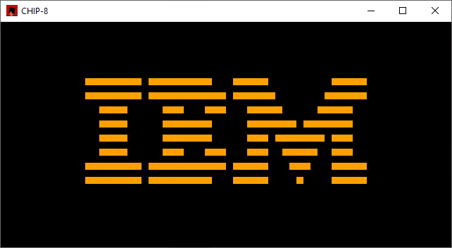

A CHIP-8 interpreter written in Rust.

This project is still under development. 

The most complete program I've written for it so far is the "font_test" collection of files, under `src/roms`. `font_test.ch8` is the "compiled" code - `Chip8::read_rom()` can be used to load it into RAM and run it. `font_test.txt` is the "decompiled" (haha) code with comments, as well as an explanation of a few things that I wish I'd had explained to me while I was writing this. I've also included a copy of the common IBM logo ROM.
